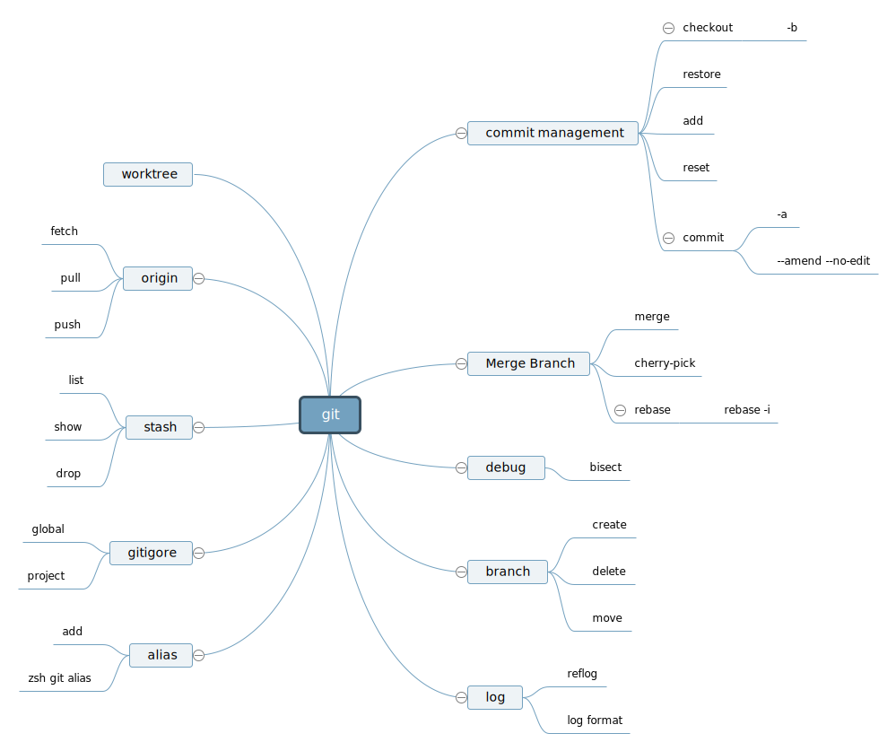

# Css

-   盒模型

    在 html 页面中，所有元素都可以看做盒子，有边， 内边距，外边距，内容组成。

    border, padding, margin, content

-   css 选择器的优先级

    !important > style > id > class > extends

-   px vs rem

        px： 像素
        rem: 相对于html的font-size做的相对大小， html font-size可以是 px 或 %， % 是 16px * %

-   重绘和重排的区别

    重排：布局引擎会根据 css 计算出元素在页面中的位置和大小
    重绘：浏览器根据 css 样式的变化，对元素的样式进行重新绘制
    

-   水平垂直居中

    position + margin | transform
    flex

        content 对应的是多行内容， items 对应的是item, 单行的， self是设置每个item的
        ```
            div {
                display: flex;

                place-content: center; /* 可以传递两个值，align-content justify-content, 如果只给一个，默认两个值相同  */
                align-content: center; /* 作用于多行 */
                justify-content: center; /* grid 属性，在flex中不起作用 */

                /* flex: 1 1 auto; 等价于下面三行代码 */
                flex-grow: 1;
                flex-shrink: 1;
                flex-basis: auto;

                align-items: center; /* 作用于单行  */
                justify-items: center; /* 同上 */
            }

        ```

    grid
    table

-   css 哪些属性可以继承

    1. 字体
    2. 文本属性
    3. 元素可见性
    4. 表格布局
    5. 列表属性

-   scss

    1. 变量

        ```
         $highlight-color: #F90;

         div {
            color: $highlight-color;
         }
        ```

    2. 嵌套
       嵌套分为属性嵌套和 selector 嵌套

-   如何根据 system 设置 dark, light, 在 auto 模式下也可以区分，你可以在 console 中 check the value

    window.matchMedia('(prefers-color-scheme: dark)').matches

    ```
    @media (prefers-color-scheme: dark) {

    }
    ```

-   Sass @use @import @forward 区别

    三个都是导入用的

        @import 是直接导入，可能会有命名冲突，sass 已经暂停对@import 的支持，
        @use 是@import 的替代，导入时需要定义导入模块名，
        @forward 支持@use 和 @import 的方式，在 sass 中通常作为整合模块的中转站

    ```
        // _button.sass
        .btn-style {
            background: blue;
            border-radius: 2px;
            color: white;
        }

        @import 'buttons';
        .new-style {
            @include .btn-style;
        }


        @user 'buttons' as btn;

        .new-style {
            @include btn.btn-style;
        }
    ```

-   less vs sass

    less 和 sass 都是 css 预处理器，包含的语法类似.

    sass 有 @mixin @include @extend @use @forward @import 等

        参数取值 #{$var}

        mixin： 只接受字符串，不能处理., #之类的selector 样式选择，不支持重写，可以处理默认值

        extend: sass extend做了很多处理，它会判断标签是否合法，重名且中间是空格的会合并，对于空格selector的处理，会将所有可能性的样式selector组合都输出出来，会出现一些意想不到的selector，影响其他布局。这个是很灵活的，记得验证。

        @each: 循环处理一些样式

            $icons: ("eye": "\f112", "start": "\f12e", "stop": "\f12f");

            @each $name, $glyph in $icons {
                .icon-#{$name}:before {
                    display: inline-block;
                    font-family: "Icon Font";
                    content: $glyph;
                }
            }

        @if

            $light-background: #f2ece4;
            $light-text: #036;
            $dark-background: #6b717f;
            $dark-text: #d2e1dd;

            @mixin theme-colors($light-theme: true) {
                @if $light-theme {
                    background-color: $light-background;
                    color: $light-text;
                } @else {
                    background-color: $dark-background;
                    color: $dark-text;
                }
            }

            .banner {
                @include theme-colors($light-theme: true);
                body.dark & {
                    @include theme-colors($light-theme: false);
                }
            }

    less 对应的

        参数取值 @{var}

        mixin: 所有的样式都可以为mixin, 在引用的时候，不需要加任何关键字，直接在里面写样式就行，当然你也可以在样式后面加括号，效果一样，但定义的时候，样式加括号的，不会显示, mixin支持重写，即相同名称，不同参数，会匹配多个，即传递多个值，能同时匹配到后面一个参数为可选的mixin，用@加参数名可以不遵守传参顺序

        extend: :extend()，extend是类似function的函数，里面可以传递组合selector, sass没有组合extend的写法，extend不会判断是否合法，不会合并class, 默认只在当前作用域内找，如果加all，会递归到字作用域内
        继承里面匹配的是字符串，所以顺序不同的，样式一样也不会匹配
        用参数名定义继承内的名字，无论怎么操作都不会正确继承，用参数定义继承的名字，在继承内部输入具体的继承名，高版本可以被继承
        用参数来定义样式名，然后继承其他样式，在高版本，这个是无法真正继承的

        导入： @import

        less 可以批量加!important


            .important {
                .foo() !important;
            }

        less没有循环的语法，但有when判断条件，在mixin中调用自身，通过when来判断是否中断，可以达到loop的目的

            .generate-columns(4);

            .generate-columns(@n, @i: 1) when (@i =< @n) {
                .column-@{i} {
                    width: (@i * 100% / @n);
                }
                .generate-columns(@n, (@i + 1));
            }

        if:

            when 可以做if 用， 用 and, not, or 来表示三种关系

            @dr: if(@my-option = true, {
                button {
                    color: white;
                }
                a {
                    color: blue;
                }
            });
            @dr();

# JS

-   js 组成

    1. js 语法 ECMA script
    2. DOM 对象模型
    3. 浏览器对象模型 BOM

-   js 内置对象

    1. 基本类型
    2. Promise
    3. Math
    4. RegExp

-   操作数组方法

    不改变原数组的：

    1. map
    2. filter
    3. slice
    4. with

    改变原数组：

    1. splice
    2. sort
    3. reverse
    4. push
    5. pop
    6. unshift
    7. shift
    8. copyWith

    others:

    1. reduce
    2. join
    3. concat

-   js 类型检测

    1. typeof 检测基础类型，数组返回的是 Object
    2. instanceof 检测除基础类型外的所有类型
    3. constructor 检测所有类型
    4. Object.prototype.toString.call() 用类的 toString 去判断

-   Object.defineProperty

    可以在 Object 中添加特殊方法，也可以在特定 object 中修改特定 key 的属性和值，常用于设定 object 中的值可更改与否。

-   闭包的特点

    闭包是函数嵌套另一个函数， 并且内部函数被外部函数返回

    优点：可以重复利用变量，并且不会污染全局。变量一直保存在内存中，不会被回收
    缺点：闭包太多会导致内存消耗过大，性能下降，内存泄漏
    应用场景： 防抖， 节流，避免全局参数污染

-   js 垃圾回收机制

    1. 标记清除： 在 js 中，由 global 往下根据引用查找标记，未被标记的会视为可回收的变量资源，执行回收操作.
    2. 引用计数： 声明一个变量，将这个变量赋值给另一个引用，次用+1，当引用变了，不再是当前变量，次数-1，整体运行下来，次数为 0 的删除

-   防抖(debounce)，节流(throttle)

    debounce：最后一次变化 n 秒后，触发 function, 任何变化都会触发重新计时
    thtottle: 触发 function 之后的 n 秒内，不会再次触发 function.

-   内存泄漏

    内存泄漏是 js 已经分配资源的对象长时间得不到或无法释放， 造成长期占用内存的现象。
    内存泄漏浪费大量内存，长时间会导致系统运行缓慢，甚至崩溃

    内存泄漏的因素：

    1. 循环引用
    2. 全局变量
    3. 闭包导致的变量脱离当前函数的上下文，和闭包内相互依赖
    4. setTimeout/setInterval 未被清理
    5. dom 的绑定事件在 dom 清理后，未及时清理

-   事件委托

    根据事件冒泡的机制，将子元素的事件绑定到父元素来实现,当子元素很多的时候，绑定到子元素上会很不方便，可以用事件委托
    对事件冒泡进行阻止的元素无法用事件委托，阻止方法： event.stopPropagation();
    提高性能，减少绑定

-   基本数据类型和引用数据类型的区别

    基本数据类型：

        1. 保存在栈中

    引用数据类型:

        1. 保存在队内，栈中是内存地址
        2. 两个引用值指向同一个地址，其中一个值变了，所有地方的值都会变

-   js 原型和原型链

    1. 原型，所有的函数默认都有一个“prototype”这样公有且不可枚举的属性，它会指向另一个对象，这个对象就是原型。
    2. 原型链，当访问对象的属性或方法时，首先对象会从自身去找，找不到就会往原型中去找，也就是它构造函数的“prototype”中，如果原型中找不到，即构造函数中也没有该属性，就会往原型后面的原型上去找，这样就形成了链式的结构，称为原型链。

-   js new 对象, 对象也是 function 的一种

    1. 创建一个 null 的 Object
    2. 将新对象的 prototype 赋值给新创建的对象
    3. 将参数赋值给新的对象
    4. 根据基础类型还是引用类型， 返回值或者新创建的对象

    ```
        export function newFun(fn: any, ...args) {
            let myObj = {};
            myObj.__proto__ = fn.prototype;
            let result = fn.apply(myObj, args);

            return result instanceof Object ? result : myObj;
        }
    ```

-   js 继承机制

    1. 原型链继承

        可以继承方法和参数，但不能传参. 对象实例共享所有父类参数，一个改变，之后的都会改变

        ```
            Child.prototype = new Parent();
        ```

    2. 构造函数继承

        可以传参，但不能继承 function

        ```
            Parent.call(this, ...args);
        ```

    3. 组合继承

        ```
            function Child(...args) {
                Parent.call(this, ...args);
            }

            Child.prototype = new Parent();
        ```

        可以实现传参，也能用父类的方法， 但父类会调用两次， 在 call 和 prototype 中各一次

    4. extends

-   this 指向问题

    this 基本指向函数的上一级, 上一级如果是 global,则指向 window.
    箭头函数本身没有 this，它指向上层 this, 如果上层没有，继续向上找。
    new, apply, call，bind 都可以改变 this 指向，在编程中，调用第三库，可能会遇到

-   箭头函数和普通函数的区别

    箭头函数某些情况下可以省略{}，return, 可以将 code 写在同一行，用在数组操作中更简洁直观

    可以把箭头函数整体看成是参数，但具有函数的基本特性

    区别

    箭头函数：

    1. 不能用 arguments
    2. 没有 prototype
    3. 不能使用 new
    4. 能处理普通函数无法访问的 this，不如数组循环中访问 this.

-   装饰器函数

    在 TypeScript 中，装饰器（Decorators）是一种特殊类型的声明，它可以附加到类声明、方法、属性或参数上。装饰器使用 @expression 的形式，其中 expression 必须求值为一个函数，该函数将在运行时被调用，作为被装饰的声明的一部分。

    ```
        function log(target: any, methodName: string, descriptor: TypedPropertyDescriptor<any>) {
            ....
        }
    ```

    函数有三个参数

    target: 原型

    methodName: 方法名或属性名

    descriptor: descriptor（一个具有可配置（configurable）和可枚举（enumerable）属性的对象）

    类声明的时候，只能有一个参数，就是类原型

    属性声明有两个参数，类原型和属性名

    方法声明有三个参数，常用的是第三个参数， descriptor.value 是装饰器标识的 function

    ```
    function log(target: any, methodName: string, descriptor: TypedPropertyDescriptor<any>) {
        let originalMethod = descriptor.value;
        descriptor.value = function (...args: any[]) {
            console.log(`Calling: ${methodName}(${args.join(', ')})`);
            let result = originalMethod.apply(this, args);
            console.log(`Called: ${methodName}`);
            return result;
        };
    }

    ```

-   script 标签的 defer 和 async 作用和不同

    green: html 解析
    blue: script file load
    red: script 执行
    grey: 阻塞

    1. script loaded

        

    2. script async loaded

        

    3. script defer loaded

        

-   es6 或者说 es2015 新增了哪些特性

    1. 块级作用域(const let)

        1. 不存在变量提升，即不能在声明前使用它， var 可以，只是取到的是 undefined
        2. 不能在同一作用域重复声明
        3. 在全局声明中，var 创建的参数是在 window 对象上的， let 声明的变量和 window 对象没关系
        4. 作用域是块级的，出了当前块，就拿到的是 undefined

    2. class
    3. symbol

        Symbol.iterator 可以使 class 变成可以迭代的，从而使 class 可以用迭代,当然，你可以用 list 来存数据.

        ```
        [Symbol.iterator]() {
            let index = 0;
            const list = this.list;
            return {
                next: () => ({value: list[index++], done: index>list.length}),
            }
        }
        ```

        Symbol.toStringTag 可以定制 toString 输出信息，和 toString 不同, 如果有 toString, 这个就不需要了

        ```
            get [Symbol.toStringTag]() {
                return "Test";
            }

            new Class().toString() => [object Test]
        ```

        Symbol.toPrimitive 根据需要的值，可以定制转化结果.

        ```
            class MyDateTime {
                constructor(year, month, day, hour = 0, minute = 0, second = 0) {
                    this._datetime = new Date(year, month - 1, day, hour, minute, second);
                }
                [Symbol.toPrimitive](hint) {
                    switch (hint) {
                        case "number":
                            return this._datetime.getTime();
                        case "string":
                            return this._datetime.toLocaleString();
                        default:
                            return this._datetime.toString();
                    }
                }
            }

            console.log(myDate); // 输出：Sat Apr 08 2023 15:30:00 GMT+0800 (中国标准时间)
            console.log(myDate + 10000); // 输出：1699950200000
            console.log(`${myDate}`); // 输出："2023/4/8 下午3:30:00"
        ```

        Symbol.replace | Symbol.match | Symbol.split

        当你需要特殊处理的时候，可以用这三个声明 customer RegExp, 格式为 { [Symbol.replace | Symbol.match | Symbol.split]: customerFn }

    4. 函数的参数默认值
    5. import and export
    6. set map
    7. generator

        yieled 控制输入，每次运行只输入一个

    8. arrow function
    9. promise

        race: 任何一个 promise 返回都返回，无论是 resolved or rejected
        all: 最后一个返回，返回

    10. 结构赋值

        ```
            const { a, b, c: { d }} = test;
        ```

-   js promise, setTimeout 调用顺序的问题

    js 有两个任务队列，一个存 promise（微任务队列）, 一个存 setTimeout 事件（宏任务队列）。当执行 js code 的时候，会顺序执行，遇到 promise 会把他存到一个任务序列中，遇到 setTime，存到另一个任务队列，code 顺序执行完了，就会执行 promise 的队列中的任务，然后检查 setTime 所在的队列，然后根据时间，来执行
    如果中途需要等待 promise 执行完成， 可以用 async await 来执行
    需要注意， async function 内部等待，外部如果没有 await 不会等待, 在顺序执行中，遇到 await 都会阻塞

-   call, apply, bind 区别

    三种方法： 第一个参数都是 this, bind 只有一个参数

    call 和 apply 出了传参不同，其他都相同， call 传递参数， apply 传递参数列表

    bind 之后，还是函数

-   如何实现一个深拷贝

    1. ... 扩展运算符

    2. JSON.stringify

        JSON.stringify 支持 3 个参数，0: object, 1:通常为 null，返回所有，你可以给一个 key 数组，function,返回固定的 key. 2: format json， 数字代表每行前面几个空格. 详情看 testing 下的[json_stringigy.js](./testing/json_stringify.js)

    3. 递归

-   js 事件循环

    js 是单线程的，js 先执行同步任务，遇到 promise 和 setTimeout， 把他们分别加入到微任务和宏任务队列中，然后在同步代码执行完成后，执行微任务队列，然后执行宏任务队列。所有的执行完成后，如果还存在同步任务，再循环执行同步任务， 微任务，宏任务，

-   ajax 是什么， 怎么实现的

    通过 AJAX 可以在浏览器中向服务器发送异步请求，最大的优势：无刷新获取数据

    当用 get 的时候，params 放在 link 中

    1. 创建 XMLHttpRequest 对象
    2. 设置请求信息
    3. 发送请求
    4. 接收响应

    ```
        let xhr = new XMLHttpRequest();

        xhr.open(method, url);
        //可以设置请求头，一般不设置
        xhr.setRequestHeader("Content-Type", "application/x-www-form-urlencoded");
        xhr.send(body); //get 请求不传 body 参数，只有 post 请求使用
        //xhr.responseXML 接收 xml 格式的响应数据
        //xhr.responseText 接收文本格式的响应数据
        xhr.onreadystatechange = function () {
            if (xhr.readyState == 4 && xhr.status == 200) {
                var text = xhr.responseText;
                console.log(text);
            }
        };
    ```

-   get VS post

    get 会一次性把 header 和 data 发出去，post 会先发 header 然后发送 data， get 只需要发一个 tcp 包， post 需要两个 tcp 包

    1. get 获取数据，post 创建修改数据
    2. get 参数在 link 上， post 在 body 中
    3. get 退回没啥影响，post 退回会重新发送
    4. get 会缓存，post 不会
    5. get 历史能找到， post 找不到
    6. get 支持 url 编码， post 支持各种编码

-   Promise 内部原理，优缺点

    Promise 是封装了一个异步操作，并返回成功与失败结果的类

    回调地狱： 嵌套达 3 层及以上，使代码可读性严重下降的回调函数，

    Promise 主要解决异步回调地狱的问题

    pending -> succuss. pending -> failure

    promise 原理:

        构造一个promise实例, 需要两个形参，分别是resolve 和 rejected 函数. 基本上第一个步不用声明rejected， 因为没有前一步，就没有error
        then 方法传参和promise一样， 根据前一步结果，返回两个函数中的任何一个

-   promise vs async await

    1. promise 是 es6, async await 是 es7
    2. async await 是基于 promise 实现的，都是非阻塞性的
    3. 都是处理异步请求的

    优缺点：

    1. Promise 是返回对象， 需要用 then catch 捕获结果和异常，容易造成代码层叠，不好维护，async await 让代码看起来像顺序执行一样， 可以用 try catch 捕获异常
    2. async 可以拿到结果，后面的代码直接用， promise 后面的代码想用 promise 的返回，只能放在 then 里面

-   浏览器存储方式

    1. cookies

        1. H5 前的标准存储方式
        2. 兼容性好
        3. 存储量小，资源浪费， 使用麻烦

    2. localStorage

        1. 操作方便，永久存储， 可以跨页面取数据，但隐私模式下读不到非隐私下的 localStorage, 不可被爬虫

    3. sessionStorage

        1. 会话级别的存储方式，只在当前页面可以找到，跨页面无法读取

    4. indexDB

        相当于在前端创建一个新的简单的数据库。作为了解，不做要求

        1. [code](./code/indexdb.js)

-   token 是存在 localStorage 还是 cookies

    1. 存 localStorage 中， token 记录加密的登录信息，可以实现跨页面的登录校验，不过在 header 中需要加上，以备 backend 验证， 但是容易被 xss 攻击

    xss: XSS 攻击通常指的是通过利用网页开发时留下的漏洞，通过巧妙的方法注入恶意指令代码到网页，使用户加载并执行攻击者恶意制造的网页程序。这些恶意网页程序通常是 JavaScript，但实际上也可以包括 Java、 VBScript、ActiveX、 Flash 或者甚至是普通的 HTML。攻击成功后，攻击者可能得到包括但不限于更高的权限（如执行一些操作）、私密网页内容、会话和 cookie 等各种内容。

    2. 存 cookie 中，自动发送，不能跨域， 容易被 csrf 攻击

    CSRF（跨站请求伪造）是一种网络攻击方式，它允许攻击者在未经授权的情况下，通过诱导用户访问第三方网站并利用这些网站的接口功能，模拟合法用户的行为并向受害网站发出请求。由于这些请求看起来像是来自受信任的用户，因此在许多情况下，它们可能会成功执行而不引起怀疑。CSRF 攻击可能涉及以下几种情况：

    GET 类型的 CSRF 攻击：在这种攻击中，攻击者可能在网页上嵌入恶意图片，当用户访问该网页时，恶意图片会触发一个 HTTP GET 请求，从而可能导致未经授权的操作。
    POST 类型的 CSRF 攻击：攻击者构造一个表单，将其隐藏起来，并在用户访问页面时自动填写并提交这个表单。
    链接类型的 CSRF 攻击：攻击者创建一个包含恶意链接的 HTML 文档，当用户点击该链接时，会导致相同的未经授权的操作。
    CSRF 攻击的危险在于，攻击者可以冒充合法用户执行各种操作，如发送垃圾邮件、获取敏感信息、执行财务交易等。由于 CSRF 攻击利用的是 Web 应用程序的身份验证机制，而不是直接攻击服务器上的数据，因此它们相对不易检测和防御。CSRF 曾被评为网络安全领域的一大隐患，并且在实际中被广泛利用

-   token 的登录流程

    1. 客户端用登录用户名密码登录
    2. 服务端验证 user 和 password
    3. 验证成功， 服务端会签发一个 token，发送会客户端
    4. 客户端收到 token，存储起来
    5. 客户端每次请求都携带 token
    6. 服务器收到 token，验证通过，返回数据

-   页面渲染过程

    1. DNS 解析
    2. 建立 tcp 连接
    3. 发送 http 请求
    4. 服务器处理请求
    5. 渲染页面

        浏览器获取 html css, 然后解析成 dom 树，将 css 和 dom 树合并成渲染树，并布局，将布局后的渲染树节点渲染到浏览器中

    6. 断开 tcp 连接

-   DOM 树和渲染树有什么区别

    DOM 树和 HTML 一一对应的， 包含 header 和隐藏标签， 渲染树不包含 header 和隐藏标签

-   精灵图 vs base64

    精灵图： 为了减少请求次数，将小的图标整合到一张图中，通过移动显示局部来达到显示图标的目的
    base64：把原本的二进制图片变成 64 位字符的编码方式，存在编码后的字符比原图大的情况

    base64 是会和 html css 一起加载到页面中的，减少请求，跨域问题，但有的浏览器版本较低，可能不支持

-   svg

    基于 xml 格式的的图像格式，可以缩放的矢量图，本质上是图像路径的描述文本，体积小.

    1. `<svg></svg>`
    2. ``
    3. 转成 base64 显示

-   jwt

    全称： json web token

    通过 json 形式作为 web 应用中的令牌， 可以在各方安全的作为 json 对象传输，信息传输，授权等

    jwt 认证流程：

    1. 用户登录 user password
    2. 后端对密码进行验证，将用户信息进行 base64 编码后，签名，并加入过期时间，返回前端
    3. 前端请求加在 header 中
    4. BE 验证 签名，过期时间等，通过直接返回结果

-   npm 底层环境是什么

    node package management.

    npm 组成： npm 网站（仓库）, 注册表， 命令行工具

-   npm vs pnpm vs yarn

    三个都是 js lib 管理工具， npm 是最早的， yarn 是继 npm 之后的，为了解决 npm 依赖和性能问题出现的 pnpm 是新开发的，通过 folder link 解决各种依赖的问题

    npm 与 yarn 文件结构相似，都是通过文件系统来确保每个 lib 和 project 的安装完成，yarn 比 npm 块是因为 yarn 有一个公共缓存，会缓存你下载的所有包， 所以看到比较快。npm yarn 都有对应的版本控制文件，npm 对版本控制文件的依赖没有 yarn 那么强，所以导致有些时候会因为版本不同导致一些问题

    pnpm 是通过文件 link 来关联包的，所以得依赖只会有一份，所以空间更小，速度更快，兼容性和稳定性没有 npm 和 yarn 那么时间的考验，不确定

-   跨域问题解决方案

    1. nginx 跨域配置
    2. Access-Control-Allow-Origin, Access-Control-Allow-Methods, Access-Control-Allow-Headers 配置
    3. JSONP： 创建 script 标签来实现的

-   浏览器缓存策略

    1. 本地缓存（强缓存）

        不发送请求， 直接使用缓存内容： js css images

    2. 协商缓存（弱缓存）

        需要发送请求，根据判断来决定是否缓存，基本是请求条件

    强缓存触发条件：

        Http1.0 时间戳响应头
        Http1.1 Cache-Control 响应标头

    协商缓存触发条件

        Http1.0 请求头： if-modified-since, 响应头： last-modified
        Http1.1 请求头： if-none-match, 响应头： ETag

-   同源策略

    https:// baidu.com: 80

    url link 的协议，域名，端口号相同

    跨域的三个标签： img script link

-   JSON

    纯字符串的数据， key - value 键值对组成，适合在网络中传输

    使用场景： 数据传输， jwt token, 配置文件， 定义接口

-   无感登录

    1. 项目中基本定义两个 token， token 和 refreshToken, token 过期后，自动用 refreshToken 来获取 token， refreshToken 基本长过 token 的过期时间
    2. 定时器重新刷新 token
    3. api 返回 401，刷新 token

-   降低页面加载时间的方法

    1. 减少图片大小，按需引入
    2. 懒加载
    3. keep-alive
    4. 减少接口请求次数
    5. gzip 打包

-   如何保证消息实时通知和接收

    Http Server-Send-event

    WebSocket

    MQTT

-   大文件上传

    主要有分块上传 和 断点续传

    1. RandomAccessFile: Java 中的一个类，可以实现对文件的随机访问，适用于断点续传功能的实现。
    2. HttpURLConnection： Java 中用于处理 HTTP 请求的类，可以通过设置请求头部信息实现下载文件的断点续传。
    3. Apache Commons IO： 一个常用的开源工具库，提供了许多与 IO 相关的操作，例如读写文件、复制文件等。
    4. Java NIO（New IO）： 一种非阻塞 IO 的编程方式，可以提高文件分片的效率。

    断点续传

    ```
        import java.io.IOException;
        import java.io.InputStream;
        import java.io.RandomAccessFile;
        import java.net.HttpURLConnection;
        import java.net.URL;

        public class ResumeDownload {
            private static final String FILE_URL = "http://example.com/file.txt";
            private static final String SAVE_PATH = "/path/to/save/file.txt";
            private static final String TEMP_PATH = "/path/to/save/file.txt.tmp";

            public static void main(String[] args) {
                try {
                    URL url = new URL(FILE_URL);

                    HttpURLConnection connection = (HttpURLConnection) url.openConnection();
                    connection.setRequestMethod("GET");
                    connection.setConnectTimeout(5000);
                    connection.setReadTimeout(5000);

                    long startPosition = 0;
                    if (connection.getResponseCode() == HttpURLConnection.HTTP_PARTIAL) {
                        startPosition = connection.getHeaderFieldLong("Range", 0);
                    }

                    RandomAccessFile file = new RandomAccessFile(SAVE_PATH, "rw");
                    file.seek(startPosition);

                    InputStream inputStream = connection.getInputStream();
                    byte[] buffer = new byte[1024];
                    int length;
                    while ((length = inputStream.read(buffer)) != -1) {
                        file.write(buffer, 0, length);
                    }

                    file.close();
                    connection.disconnect();

                    System.out.println("Download completed.");
                } catch (IOException e) {
                    e.printStackTrace();
                }
            }
        }
    ```

    分片上传

    ```
    import java.io.IOException;
    import java.io.RandomAccessFile;

    public class FileSplit {
        private static final String FILE_PATH = "/path/to/source/file.txt";
        private static final String SAVE_PATH = "/path/to/save";

        public static void main(String[] args) {
            try {
                RandomAccessFile file = new RandomAccessFile(FILE_PATH, "r");

                byte[] buffer = new byte[1024 * 1024]; // 每个文件块的大小为1MB
                int index = 0;
                int count;
                while ((count = file.read(buffer)) != -1) {
                    String chunkName = String.format("%s/file_%d", SAVE_PATH, index++);

                    RandomAccessFile chunk = new RandomAccessFile(chunkName, "rw");
                    chunk.write(buffer, 0, count);
                    chunk.close();
                }

                file.close();

                System.out.println("Split completed.");
            } catch (IOException e) {
                e.printStackTrace();
            }
        }
    }
    ```

-   webpack 打包和不打包的区别

    1. 减小文件大小，提高运行效率
    2. 转化一些不识别的语法，比如 ts，angular 之类的架构语言

-   webpack 怎么打包， babel 是做什么的

    1. webpack 将 css， img, js 当做一个模块，用 import/require 导入
    2. 找到入口文件，将相关联的文件打包到一起
    3. 将打包到一起的文件分成小的文件，异步按需加载文件
    4. 如果一个文件被多个地方引用，只会生成有一个文件
    5. 如果文件没有引入或调用，就不会打包
    6. 对于多个入口文件，引入相同的代码，可用插件把他们抽离到相同的文件里面

    babel 用以解析 ts 等语言，将他们变成基本的 js html css

-   git 操作

    

    代码写一半，想要还原，可以有以下几种方法

        ```
            git checkout : 只还原修改的

            git reset --hard： 可以还原修改的，也可以还原新增的

            git clean -fd: 可以清理修改的和新增的
        ```

-   shell

    1.  变量

        name="Test"

        local name1="test"

            local在函数中时，在函数外部无法访问

        name2=`${name}`

    2.  字符操作

        1. 合并

            name4=${name}${name1} => name4=Testtest

        2. 获取长度

            echo 'abc' | wc -L

            echo 'abc' | awk '{print length($0)}'

        3. 截取

            test='abc'

            echo ${test:0:2}

    3.  数组

        1. 数组

            test=(1 2 3)

            test[0] => 1

        2. 遍历数组

            echo ${test[*]} => 1 2 3

            echo ${test[@]} => 1 2 3

        3. length

            echo ${#test[*]}

        4. 合并

            test=(1 2 3)

            test1=(4 5 6)

            echo (${test[*]} ${test1[*]})

        5. 删除

            test=(1 2 3)

            unset test[1] => 删除 2

    4.  loop

    ```
        for((i=0;i<10;i++))
        do
            echo 'loop'
        done

        while [condition]
        do

        done
    ```

    5.  if

        ```
            num=15

            if [ $num -lt 10 ]
            then
                echo "Number is less than 10."
            elif [ $num -eq 10 ]
            then
                echo "Number is equal to 10."
            else
                echo "Number is greater than 10."
            fi
        ```

    6.  参数

        1. 按顺序取参数， 参数不带 - --之类的

            $0-$9: 是执行的 shell 脚本或命令的参数，对应从第 1 个开始的参数值， 0 是文件名或者函数名，1-9 是参数值

            $@ 参数部分组成的列表，可以遍历
            $\* 参数部分组成的列表字符串
            $# 参数长度

        2. 按名称取参数, 短的用 getopts,长的需要安装 getopt 库来实现， 通过 getopt_long 操作

            \? 未知的
            : 前面都不满足的情况

            ```
            while getopts ":a:b:c:" opt; do
                case $opt in
                    a)
                        a="$OPTARG"
                        ;;
                    b)
                        b="$OPTARG"
                        ;;
                    c)
                        c="$OPTARG"
                        ;;
                    \?)
                        echo "无效的选项: -$OPTARG" >&2
                        exit 1
                        ;;
                    :)
                        echo "选项 -$OPTARG 需要一个参数" >&2
                        exit 1
                        ;;
                esac
            done
            ```

    7.  case-in-esac

    8.  select in

        这个语法是交互用的，基本上根据用户操作，做出相应的动作，只执行一次

        可以通过 read 来确定键盘输入：

            read -p "input your password:" -s pwd

            echo ${pwd}

            read 参数

                -s	隐藏用户键入的值
                -p	打印提示信息来提示用户输入正确的内容
                -t	设置用户输入的时间限制；超时则退出程序
                -n	限制用户输入内容的长度(单位是字符位)
                -r	允许用户输入特殊字符，如 空格、/、\、？等
                -a	赋值数组
                -u	从给定文件描述符(fd=N)中读取数据
                -d	表示delimiter，即定界符
                -e	只用于互相交互的脚本，它将readline用于收集输入行

    9.  文件操作

        将加过输入到文件中

        ```
            > 覆盖操作
            >> 追加到文件末尾

        ```

        读取文件内容

        cat | less | header -n | more | tail -n

        header 和 tail 相反

-   文件权限

    文件系统有三组权限， 分别为 用户权限 组权限 其他用户权限
    同时计算规则为三位二进制数： 第一位为 read, 第二位为 write, 第三位为 operate
    755 为 111 101 101

-   angular hook

    1.  ngOnChanges When an input or output binding value changes.
    2.  ngOnInit After the first ngOnChanges.
    3.  ngDoCheck Developer's custom change detection.
    4.  ngAfterContentInit After component content initialized.
    5.  ngAfterContentChecked After every check of component content.
    6.  ngAfterViewInit After the views of a component are initialized.
    7.  ngAfterViewChecked After every check of the views of a component.
    8.  ngOnDestroy Just before the directive is destroyed.

-   angular 优势

    支持双向数据绑定
    它遵循 MVC 模式架构
    它支持静态模板和 Angular 模板
    您可以添加自定义指令
    支持验证
    客户端和服务器之间的通讯便利
    支持依赖注入

-   angular ChangeDetectionStrategy

    Default: 值变化，会跟着更新

    OnPush: Input 变化，会更新

-   angular ChangeDetectorRef

    detach: 分离变化检测器

    reattach：如果需要重新连接变化检测器，可以调用 reattach() 方法

    detectChanges： 手动触发变化检测器

-   StandAlone

    @if @else | @swith @case @default | @for @empty

    @defer @loading @placeholder @error

    | trigger                        | Triggers...                                   |
    | ------------------------------ | --------------------------------------------- |
    | on idle                        | when the browser reports idle state (default) |
    | on viewport(\<elementRef>?)    | when the element enters the viewport          |
    | on interaction(\<elementRef>?) | when clicked, touched, or focused             |
    | on hover(\<elementRef>?)       | when element has been hovered                 |
    | on immediate                   | when the page finishes rendering              |
    | on timer(\<duration>)          | after a specific timeout                      |
    | when <condition>               | on a custom condition                         |

-   如何规避循环依赖

    1. 将一个依赖的部分抽到一个公共部分，删除依赖
    2. 通过 forwardRef 来延迟加载，删除 eslint 中的 circularities dependence.

-   angular animations

    定义两个状态和样式，然后从左到右和从右到左的状态变化和对应的时间

    ```
        animations: [
            trigger('openClose', [
                state('open', style({
                    height: '*',
                    opacity: 1,
                    backgroundColor: 'yellow'
                })),
                state('closed', style({
                    height: '0px',
                    opacity: 0,
                    backgroundColor: 'transparent'
                })),
                transition('open => closed', [
                    animate('1s')
                ]),
                transition('closed => open', [
                    animate('0.5s')
                ])
            ])
        ]
    ```

-   angular inject

    在 angular 中，可以用 inject 取 service， HttpContextToken 可以存储值

-   ts genericity

    ```
        export type GenericityTest<T> = {
            [K in keyof T]: T[K] extends String
                ? T[keyof T]
                : {
                    [L in keyof T[K]]: T[K][L];
                };
        };

    ```

-   angular http client

    intercepter 支持两个参数，req, next， 你可以在 req 中加参数，也可以在 next 之后处理返回的结果，通常用 interceptor 加 token，处理 401refresh，和统一错误处理之类的

    请求参数：

         observe: 'response'： 返回http response, 带请求状态和body

         responseType: 默认 json, 也支持其他类型：blob， arraybuffer， text

         reportProgress： 更新进度条，event type为 HttpEventType.UploadProgress，则表示在进行中， HttpEventType.Response 表示upload完成

-   angular AOT 流程

    AOT: Ahead-of-time

    | 阶段         | 详情                                                                                                                                                                 |
    | ------------ | -------------------------------------------------------------------------------------------------------------------------------------------------------------------- |
    | 代码分析     | 在此阶段，TypeScript 编译器和 AOT 收集器创建源代码的表示。收集器不会尝试解释它收集的元数据。它会尽可能地表示元数据，并在检测到元数据语法违规时记录错误。             |
    | 代码生成     | 在此阶段，编译器的 StaticReflector 解析在第一阶段收集的元数据，对元数据进行额外验证，并在检测到元数据限制违规时引发错误。                                            |
    | 模板类型检查 | 在这个可选阶段，Angular 模板编译器使用 TypeScript 编译器来验证模板中的绑定表达式。您可以通过设置 strictTemplates 配置选项显式启用此阶段；请参阅 Angular 编译器选项。 |

    简单来说，

    1. typescript 编译成\*.d.ts，AOT 收集器收集元数据到.metadata.json，这步不关心错误。
    2. 根据特定的规则解析 metadata.json，对一些不符合规则的代码进行重写
    3. 类型和规则检查

-   RegExp

    1. \S: 除换行符，空格外，所有的字符
    2. \s： 换行符 空格
    3. \w: 字符下划线
    4. \W: 特殊字符

    标志位：

    1. g: 全局匹配
    2. i: 忽略大小写
    3. m: 换行匹配

-   react 如何根据不同的权限访问不同的页面

    1. 在页面根据不同的权限隐藏相应的菜单
    2. 在 middleware 中验证 link 是否有权限 open

-   nextjs router 规则

    1. 以文件嵌套为路径
    2. 带[]的文件，[] 内是 link 中的值，可以为任意你需要传进组件的值，用 \[slug\] 为例, 取值如下：

        ```
        export default function Page({ params }: { params: { slug: string } }) {
            return <h1>My Page</h1>
        }
        ```

    3. @开头的文件不显示在 link 中

-   useState 过程

    当调用 setState 时， React 做的第一件事是将传递给 setState 的对象合并到组件的当前状态，这将启动一个称为和解（ reconciliation）的过程。
    和解的最终目标是，根据这个新的状态以最有效的方式更新 DOM。
    为此， React 将构建一个新的 React 虚拟 DOM 树（可以将其视为页面 DOM 元素的对象表示方式）。
    一旦有了这个 DOM 树，为了弄清 DOM 是如何响应新的状态而改变的， React 会将这个新树与上一个虚拟 DOM 树比较。
    这样做， React 会知道发生的确切变化，并且通过了解发生的变化后，在绝对必要的情况下进行更新 DOM，即可将因操作 DOM 而占用的空间最小化。

-   react hooks

    State Managemant

        useState:

        useReducer

        useSyncExternalStore

    Ref Hooks

        useRef

        useImprativeHandle

    Effect Hooks

        useEffect

        useLayoutEffect

        useInsertionEffect

    Context Hooks

        useContext

    Random Hooks

        useDebugValue

        useId

    Transition Hooks

        useTransition

        useDefferedValue

    Performance Hooks

        useMemo

        useCallBack

    React 19

        useFormStatus

        useFormState

        useOptimistic

        use

    useState: 更新视图用的，只有绑定 state 的变量变化才会重新渲染

        当需要在函数组件中管理状态时，如计数器、表单输入等

    useEffect: 处理 state 变化引起的副作用，在 angular 中，我们有时候会在 set 中做其他操作，类似这个

        需要在组件渲染后或某些状态改变后执行一些副作用操作时，如数据请求、清理操作等

        当useEffect返回function, 会在component销毁的时候执行，在类组件中，可以调用componentDidUnMoment

        useEffect 参数数组如果为空，只在加载和卸载组件的时候执行

    useContext: 允许你在组件树中跨多层级访问 React 的 Context 值，而无需手动逐层传递 props

        当需要在多个层级嵌套的组件之间共享数据，如用户认证信息、主题设置、语言偏好等

    useRef: “勾住”某些组件挂载完成或重新渲染完成后才拥有的某些对象，并返回该对象的引用

        获取DOM元素或DOM元素的引用

        存储不会触发组件重新渲染的变量（如计时器ID、之前的状态值等）

-   react 的逻辑

    每次变化，都会重新执行对应的 component,重新解析 js 并建立 dom,参数在 useState 中会保存变化，不在里面的，每次都会初始化，所以不会显示变化。

    useEFfect 只有在值变化的时候才会执行

-   react 如何取消请求

    AbortController 可以取消已有的 event, request, 但每次 abort 之后，需要重新实例化，通常定义一个 service,
    在 service 中 share AbortController 实例，每次 abort 之后，会重新定义一个新的 AbortController 实例，
    在取 signal 也从 service 中取值。

    angular 可以利用 switchMap 取消已经发出去的请求。

-   Typescript types

    接口和 type 的区别:

            接口主要描述对象结构。

            type主要是对已有数据结构的重组，联合，交叉。常用于递归解析数据结构，interface别名，联合type和interface等。

            接口可以作为是class实现的规范，同时定义function, type 可以定义所有接口的行为，但是数据结构

    example

        infer 声明一个临时的类型，可以在后面进行判断, 除了object和数组，其他由json过来的数据都认为是基本类型

    ```
        export type FormControlType<T> = FormControl<T> & {
            [P in keyof T]: T[P] extends Array<infer U>
                ? FormArray<FormControlType<U>>
                : FormControl<T[P]>;
        };

    ```

-   typescript 特殊操作

    ??: 判断是不是 null or undefined，其他空值为 true。

-   tsconfig

    通常有 target 决定你编译后的结果，module 决定你 export import 的结果，lib 决定哪些 es 特性你能用

    -   ‌compilerOptions‌: 这是一个对象，包含了 TypeScript 编译器的所有配置选项。

        -   ‌target‌: 指定 ECMAScript 目标版本，如 ES3、ES5、ES6/ES2015、ES2016、ES2017、ES2018、ES2019、ES2020、ES2021、ESNext 等。决定你的 code 编译结果
        -   ‌module‌: 指定模块化系统，如 commonjs、amd、system、umd、es6/es2015、es2020、esnext 等。Module 决定 export import 以哪个版本来编译
        -   ‌lib‌: 指定要包含在编译中的库，如 dom、dom.iterable、webworker、scripthost、es5、es6/es2015、es2016、es2017、es2018、es2019、es2020、es2021、esnext 等。库的编译结果
        -   ‌allowJs‌: 允许在 TypeScript 项目中包含 JavaScript 文件。
        -   ‌outDir‌: 指定输出目录。
        -   ‌rootDir‌: 指定根目录，用于解析相对模块导入。
        -   ‌strict‌: 启用所有严格类型检查选项。
        -   ‌noImplicitAny‌: 在表达式和声明中有隐含的 any 类型时发出错误。
        -   ‌strictNullChecks‌: 启用严格的空值检查。
        -   ‌strictFunctionTypes‌: 启用严格的函数类型检查。
        -   ‌strictBindCallApply‌: 启用严格的 bind、call 和 apply 方法检查。
        -   ‌strictPropertyInitialization‌: 启用严格的属性初始化检查。
        -   ‌noImplicitThis‌: 在没有明确指定 this 类型时发出错误。
        -   ‌alwaysStrict‌: 以严格模式解析，并为每个文件生成 "use strict" 指令。
        -   ‌noUnusedLocals‌: 报告未使用的局部变量。
        -   ‌noUnusedParameters‌: 报告未使用的参数。
        -   ‌noImplicitReturns‌: 在函数不是所有分支都有返回值时发出错误。
        -   ‌noFallthroughCasesInSwitch‌: 报告 switch 语句中未处理的 case。
        -   ‌allowSyntheticDefaultImports‌: 允许从没有默认导出的模块中导入默认导出。
        -   ‌esModuleInterop‌: 启用 ECMAScript 模块互操作性，允许 import \* as 从 CommonJS 模块导入。
        -   ‌preserveSymlinks‌: 保留符号链接，解析模块时使用真实路径。
        -   ‌forceConsistentCasingInFileNames‌: 强制在导入文件时保持大小写一致性。
        -   ‌skipLibCheck‌: 跳过对声明文件（\*.d.ts）的类型检查。
        -   ‌noEmit‌: 不生成输出文件。
        -   ‌emitDeclarationOnly‌: 只生成 .d.ts 文件，不生成 .js 文件。
        -   ‌sourceMap‌: 生成源映射文件（.map），用于调试。
        -   ‌inlineSourceMap‌: 将源映射嵌入到输出文件中。
        -   ‌inlineSources‌: 将源文件嵌入到输出文件中。
        -   ‌experimentalDecorators‌: 启用实验性装饰器支持。
        -   ‌emitDecoratorMetadata‌: 发出装饰器元数据，供运行时使用。
        -   ‌types‌: 指定要包含的额外类型声明文件。
        -   ‌moduleResolution‌: 指定模块解析策略，如 node、classic。
        -   ‌baseUrl‌: 指定基本目录，用于解析非相对模块导入。
        -   ‌paths‌: 指定模块路径的映射。
        -   ‌rootDirs‌: 指定根目录的列表，用于解析相对模块导入。
        -   ‌listEmittedFiles‌: 列出编译过程中发出的文件。
        -   ‌listFiles‌: 列出编译过程中涉及的所有文件。
        -   ‌suppressImplicitAnyIndexErrors‌: 抑制对隐含 any 索引签名的错误。
        -   ‌suppressExcessPropertyErrors‌: 抑制对象字面量中多余属性的错误。
        -   ‌include‌: 一个数组，指定要包含在编译中的文件或目录。

    -   ‌exclude‌: 一个数组，指定要排除在编译之外的文件或目录。
    -   ‌extends‌: 指定一个基础配置文件，当前配置会继承基础配置中的选项。
    -   ‌compileOnSave‌: 在保存文件时自动编译（通常用于 IDE 环境，如 Visual Studio）。
    -   ‌files‌: 一个数组，指定要编译的单个文件列表（通常与 include 和 exclude 结合使用）。
    -   ‌references‌: 在使用项目引用时，指定要引用的其他 TypeScript 项目的路径。

angular schematics

    创建angular schematics流程：


    1. 创建collection.json，在里面配置schematics实例
    2. 创建schema.json，index.ts,template files, schema.ts
    3. copy创建模板，并在schema.json中设置需要的参数和选项
    4. 在template中根据你的需要设置模板

    如果你在files中有多个文件，会一并生成，同时也可以生成多个文件内的template,用chain合并所有mergeWith(templateSource)


    ```

    {
        "$schema": "../../node_modules/@angular-devkit/schematics/collection-schema.json",
        "schematics": {
             "my-service": {
                "description": "Generate a service in the project.",
                "factory": "./my-service/index#myService",
                "schema": "./my-service/schema.json"
            }
        }
    }


    ├── collection.json
    ├── datagrid
    │   ├── files
    │   │   └── __name@dasherize__.service.ts.template
    │   ├── index.ts
    │   ├── schema.json
    │   └── schema.ts
    ├── package.json
    └── tsconfig.schematics.json


    __name@dasherize__:将你传递的name变成短横线隔开的形式
    camelize‌： 将单词转成驼峰
    classify‌： 将单词转成首字母大写的单词
    underscore‌： 将单词转成下滑下隔开的单词

    ```

webpack federation modules

    ```
        const ModuleFederationPlugin = require('webpack/lib/container/ModuleFederationPlugin');

        module.exports = {

            plugins: [
                new ModuleFederationPlugin({
                name: "app_name",                           // 1. 应用名称，用于唯一标识当前应用
                filename: "remoteEntry.js",                // 2. 生成的清单文件名，这个文件包含了暴露和共享的模块信息
                exposes: {                                 // 3. 暴露给其他应用的模块
                    "./Component": "./src/Component.js",     // 键是暴露给外界的模块名，值是本地模块的路径
                },
                remotes: {                                 // 4. 从其他应用消费的模块
                    app_b: "app_b@http://localhost:3001/remoteEntry.js", // 键是远程应用的名称，值是该应用的清单文件URL
                },
                shared: ["react", "react-dom"]             // 5. 与其他应用共享的依赖项
                }),
            ],
        };

        ```

    ‌eager: true‌:

    ‌预加载‌: Webpack 会在构建时尝试预先加载所有标记为共享的模块。这意味着，即使这些模块在当前的应用中并没有立即被使用，它们也会被包含在最终的构建文件中。
    ‌性能‌: 预加载可以减少在应用运行时加载共享模块所需的时间，因为它们在构建时已经被加载并准备好了。然而，这可能会增加初始构建的大小和加载时间，因为所有的共享模块都会被预先加载。
    ‌使用场景‌: 适用于那些希望减少运行时加载时间，并且可以接受较大初始构建大小的应用。

    ‌eager: false‌（或未设置 eager 属性，因为默认值通常是 false）:

    ‌按需加载‌: 共享模块只会在应用运行时被加载，当且仅当它们被实际使用时。这意味着，如果某个共享模块在当前应用中没有被使用，它就不会被包含在最终的构建文件中。
    ‌性能‌: 按需加载可以减少初始构建的大小和加载时间，因为只有实际使用的模块会被加载。然而，这可能会增加运行时加载共享模块的时间，因为需要在应用运行时动态地加载它们。
    ‌使用场景‌: 适用于那些希望减小初始构建大小，并且可以接受运行时加载时间可能稍微增加的应用。

-   代码分析

    1. webpack-bundle-analyzer
