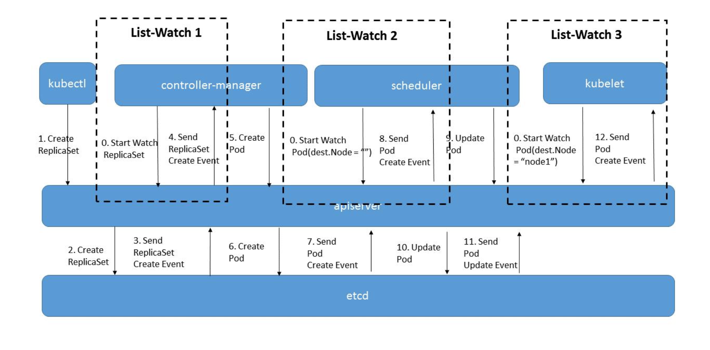

<h1>K8s Training

<h3>

```
Notes: if you are using M1, you can't use the virtual machine, fusion can't support the M1, you should use the cloud host. 
```


<h2> Docker

<h3>
1. Download docker

```
cd /etc/yum.repos.d/
wget https://mirrors.aliyun.com/docker-ce/linux/centos/docker-ce.repo
yum install -y docker-ce
systemctl enable --now docker
```

2. try docker command in the terminal

```
docker search   # search image from local
docker pull     # pull image from docker hub 
docker push     # push image from docker hub 
docker images   # list docker images 
docker rmi      # remove the image
docker run      # run the image, -P will assign the port automation, -p will set the port use user set.
docker build      # Create image.

docker ps –a -l # list the container
docker stop     # stop the container
docker rm       # remove the container
docker start    # start a container
docker attach | exec 
# attach: when the docker start, it will create a new process in you computer, attach will use this process and into the container. This will affect the docker.
# exec: it will create a new process in you computer, and operate the container, if this process is killed, don't affect the container process. 

docker save     # save the image as tar file in the local
docker load     # load image from the tar file. 
docker tag      # add tag to the image
```

3. Dockerfile
every command is one layout, if see same layout in the other image, docker pull won't pull it again.
If you install some manage tool, like yuml, clear the cache will decrease the image size.

```
    FROM      #  base image, if you want do some system image, can't use this.

    RUN       # run some command in this command, like cp, mv, sed, clear cache
    
    VOLUME    # config the storage

    CMD       # some start command

    EXPOSE    # expose the port which user can visit from the outside. 
```

<h2> 
K8s

<h3>
Prepare

1. git clone https://github.com/unixhot/salt-kubeadm.git 
2. Config the env base on [this](https://github.com/unixhot/salt-kubeadm) 

K8s Framework:


K8s use list-watch model, user send api to api resource, this api use `Transfer-Encoding: chunked` waiting, other resources watch the request will do something create the resource. If any resource don't finish, the api will resend and wait.  



All the resources: 


Notes: 
    
    when you run the ***salt-ssh '*' state.highstate***  , please wait and don't break it, it will download kubeadm、kubelet、docker and need long time.
    Before you run the kubeadm init, please change the name to your node1's hostname in the `/etc/sysconfig/kubeadm.yml`, if you don't do this, you need run `kubeadm reset -y `, this will remove all the resource you create after kubeadm init. So, take careful. 


### Config K8s Controls

1. #### Pods

    *pod is the minimum k8s unit, you can put multiple container in one pods.*

    Creat pod flow:

    

    Know how to write a pod base on a template 

    Auto scale when the cpu more than average. See HPA(horizontal pod autoscalers) \
    > kubectl get hpa

    Scheduler: 
    - No Scheduler
    - Scheduler
    - nodeSelector, nodeName
    - NodeAffinity (node), PodAffinity (pod), PodAntiAffinity (pod).    
    requiredDuringSchedulingIgnoredDuringExecution and preferredDuringSchedulingIgnoredDuringExecution. \
    Operation: IN, NotIn, Exists, DoesNotExist
    - Taints (node), Toleration (pod)

    Pod health check: 
    - ExecAction        # run exec to check 
    - TCPSocketAction   # Send ip:port to check.
    - HTTPGetAction     # send request to service, like path call /info api

    Pod exist check: 
    - Liveness/Readiness \
    Liveness/Readiness can use the 3 methods above.

    The check is in the kubelet

2. deployment

    know how to change the deploy yaml base on a template. 

    Know how to roll back deploy. \
    *Notes: if revisionHistoryLimit is 0, you can't roll back, default is 10.*
    > kubectl rollout

    Know how to change the deploy: edit, set.
    > kubectl edit|set 

3. Service

    Know how to change the service yaml base on a template

    Know how to set nodePorts.

4. Ingress

    For the ingress, we set the port is service port, not the nodePort.

5. PV(Persistent Volumes)

    PV isn't in the namespace, if you set path, please confirm you create the fold, PV doesn't create the folder automation.

    Pod can't operate the PV directly, it should use PVC link to a PV.

    Unit: 1Gi = 1024M 1G = 1000M

6. PVC(Persistent Volumes Claims)

    PVC is in the namespace, you can use the PVC link to the PV. 

7. Node

    cordon: prevent the pod schedule this Node.
    > kubectl cordon|uncordon node

    drain: clear up all the pod from this Node. 
    > kubectl drain node

    Schedule: [See Node](#pods)

8. ReplicaSet or ReplicaControl

    control the pod number, you can change it use this command: \
    `kubectl scale --replicas=n rsname`

9. Endpoint
    
    Check the pods ip.

10. ConfigMap and Secret

    ConfigMap and Secret are using key-value, different is that  Secret use base64 secret the value, ConfigMap's value can be any value.

    Can write ConfigMap and Secret in the yaml and pod base on template.

11. DaemonSet

    Run pod in every node. When you add or remove node, the pod will create or delete in the node automation. 

    You can use `kubectl rollout history` see the DaemonSet version

12. Job and CronJob

    Job will create pod when the condition satisfy and stop base on the completions (pod number), activeDeadlineSeconds (run time), and ttlSecondsAfterFinished (After finish time)

    Cron Job will create job and pod base on Schedule. [Cron Schedule Syntax](https://kubernetes.io/zh-cn/docs/concepts/workloads/controllers/cron-jobs/#cron-schedule-syntax)

13. ETCD Backing up and Restoring

    Backing up: 
    > ETCDCTL_API=3 etcdctl --cacert=/opt/kubernetes/ssl/ca.pem --cert=/opt/kubernetes/ssl/server.pem --key=/opt/kubernetes/ssl/server-key.pem --endpoints 192.168.1.36:2379 snapshot save snapshotdb 

    > etcdctl version + etcdctl + certificate + --endpoint + snapshot save + file position.

    Restoring: 

    > ETCDCTL_API=3 etcdctl --endpoints 192.168.1.36:2379 snapshot restore snapshotdb

### K8s RBAC

1. User Account vs Service Account

    User accounts are for humans. Service accounts are for processes, which run in pods.

    User accounts are intended to be global...Service accounts are namespaced.

2. ClusterRole vs Role

    ClusterRole isn't in the namespace, Role is in the namespace. 

    ClusterRoleBinding can't binding Role to user group and service account. \
    RoleBinding can binding the ClusterRole. 

3.  Create certificate 
    
    1. Generate key.\
        > openssl genrsa -out k8s.key 2048

    2. Generate csr and assign user/group, cn is user, o is group.\
        >openssl req -new -key k8s.key -out k8s.csr -subj "/CN=k8s/O=vmware"
    
    3. Use ca and cakey generate the crt. \
        >openssl x509 -req -in k8s.csr -CA /etc/kubernetes/pki/ca.crt -CAkey /etc/kubernetes/pki/ca.key -CAcreateserial -out k8s.crt -days 365
    
    4. update k8s config file.  
        > kubectl config set-credentials jenkins --client-certificate=jenkins.crt  --client-key=jenkins.key

4. Create Role and Cluster Role

5. Create RoleBinding and ClusterRoleBinding


### [kubectl commands](https://kubernetes.io/docs/reference/kubectl/cheatsheet/)

> K8s command format: \
> kubectl + operate + resource type + resource name + other params. \
> If no resource name, the kubectl will show all.

### k8s visit check

>If link don't work, please use this flow to check the visit

www.example.com--(DNS)--IP address-->firewall--->balance--->Ingress Controller--(Ingress)---Service--(name)--Endpoint--(label)--Pod---(volume)--PVC-(volumeNmae)---PV--- volume plugin（NFS）----volume（folder)


tips: 
> add the ip and name in the /etc/host, you can use `ssh name` visit, user is same with your current.

> `ipvsadm -Ln`: This can see the ip mapping. 

> vs codee can ssh the remote and do some thing. 


<!-- check顺序: kubewww.example.com--(DNS)--IP地址--防火墙---负载均衡---Ingress Controller--(Ingress)---Service--(name)--Endpoint--(label)--Pod---(volume)--PVC-(volumeNmae)---PV---卷插件（NFS）----volume（目录）-->

<!-- 发展方向： 1. 安装部署K8s   2. 管理K8S.  3. K8S发布版本 -->

<!-- 社区大于代码: 社区面向开发，开发商业化盈利带动社区发展. -->